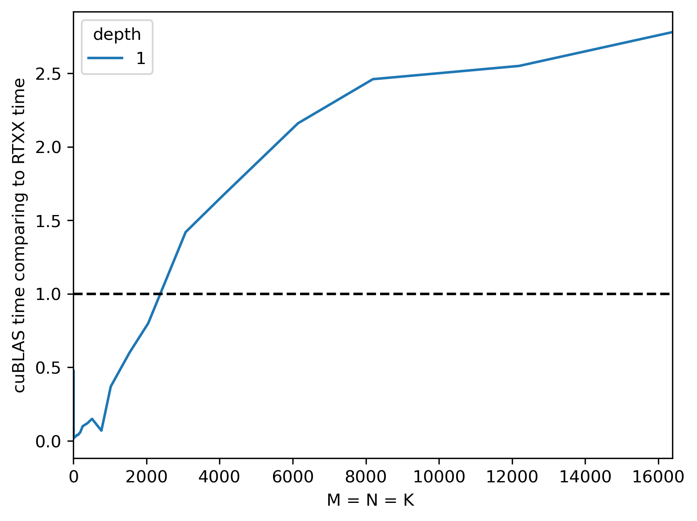

# A CUDA Implementation of RTXX *A<sup>t</sup>A* Matrix Multiplication algorithm

This is a CUDA implementation of RTXX algorithm for fast X^T X matrix multiplication. All the computations are performed **in-place** without additional memory! 

## How to install
1. Clone the repo
2. Build the binaries:
```
cmake .
make
```

You might need to install CUDA and set up environment variables before building. This is what worked for me:
```
export CUDA_HOME=/usr/local/cuda
export PATH=$CUDA_HOME/bin:$PATH
export LD_LIBRARY_PATH=$CUDA_HOME/lib64:$LD_LIBRARY_PATH
export CPATH=$CUDA_HOME/include:$CPATH
```

## How to run

### For single-precision
```
./bin/ata-sp <N> <M> <n_iterations> <check> <recursion_depth> <hide_header>
```
- `N`, `M` – matrix dimensions
- `n_iterations` – how many time to run the algorithms for better time estimation
- `check` – if 1, debugging output will be printed
- `recursion_depth` – how deep the recursion should be
- `no_header` – if 1, header of the benchmark table will be not printed, just the numbers

Example run on 8192x8192 matrix with recursion depth 3, debugging output and header on:
```
./bin/ata-sp 8192 8192 1 1 3 0
M       N       depth   cuBLAS_time     AtA_time        RTXX_time       ATA_speedup     RTXX_speedup    ATA_MAE RTXX_MAE
8192    8192    3       74.95   185.05  146.48  0.41    0.51    0.00    0.00

Block-wise absolute errors:
Format: (ATA error / RTXX error)

(0.002 / 0.002)
(0.002 / 0.002) (0.002 / 0.002)
(0.002 / 0.002) (0.002 / 0.002) (0.002 / 0.002)
(0.002 / 0.002) (0.002 / 0.002) (0.002 / 0.002) (0.002 / 0.002)
```

### For double precision
```
./bin/ata-sp <N> <M> <n_iterations> <check> <recursion_depth> <hide_header>
```

For building 

### Running the benchmark – comparison with SYRK and AtA

Build the binaries and then run:
```
chmod +x run_benchmarks.sh
./run_benchmarks.sh > benchmarking_results.txt
```

To build the plot, run `benchmark_plot.py`

## How to setup cutoff?
Set `CUTOFF` in [src/ata.h](src/ata.h)

## How much faster is it comparing to cuBLAS?

Well, it isn't 😅 While algorithmically RTXX is ~5% better than original matrix multiplication, cuBLAS is heavily optimised and beats a custom algorithm. We, however, reach performace of SYRK from cuBLAS on large matrices (16k x 16k), and by far beat an open source CUDA implementation of [AtA](https://github.com/dsforza96/AtA-gpu/tree/master), a previous SOTA (from algorithmical perspective).

Here are the benchmarking results:



## How to cite?

Original publication:
```
@misc{rybin2025xxtfaster,
      title={$XX^{t}$ Can Be Faster}, 
      author={Dmitry Rybin and Yushun Zhang and Zhi-Quan Luo},
      year={2025},
      eprint={2505.09814},
      archivePrefix={arXiv},
      primaryClass={cs.DS},
      url={https://arxiv.org/abs/2505.09814}, 
}
```

This repo:
```
@misc{RTXX-cuda,
  author = {VladimirShitov},
  title = {CUDA implementation of RTXX algorithm},
  year = {2025},
  publisher = {GitHub},
  journal = {GitHub repository},
  howpublished = {\url{https://github.com/VladimirShitov/RTXX-CUDA}}
}
```

## What to improve?
- **Use Strassen's algorithm to multiply matrices** (if you can make it faster than cuBLAS) 🚋 Implementation here is different from the paper and relies on SYRK for multiplying matrices smaller than a cutoff. While Strassen's algorithm is algorithmically better, using its open source implementation actually makes the code slower! Can you improve it? Here's a great paper to try it out 🚀
- **Remove a couple of excess computations** 📉 Here, several additions are wasted. The most obvious one is `y1` from the paper: I calculate it twice to not waste memory. Another unnecessary addition comes from storing `m22`. Explore the [computations graph](computation_graph_visualisation.html) to find more. The comments in [rtxx.cpp](src/rtxx.cpp) and [this spreadsheet](https://docs.google.com/spreadsheets/d/1fJWRUvirtdAIE_I4JtjnsC51hORBDOxCz3ZavM7MFaY/edit?usp=sharing) visualise the current algorithm.
- **Suggest a better in-memory algorithm** 🧠 How to find a general algorithm computing such a complex graph in-place is an interesting topological sorting task. Here, I did it pretty much manually, and I'm pretty sure it can be improved.
- **Write a custom CUDA kernel** and beat the cuBLAS 💪
